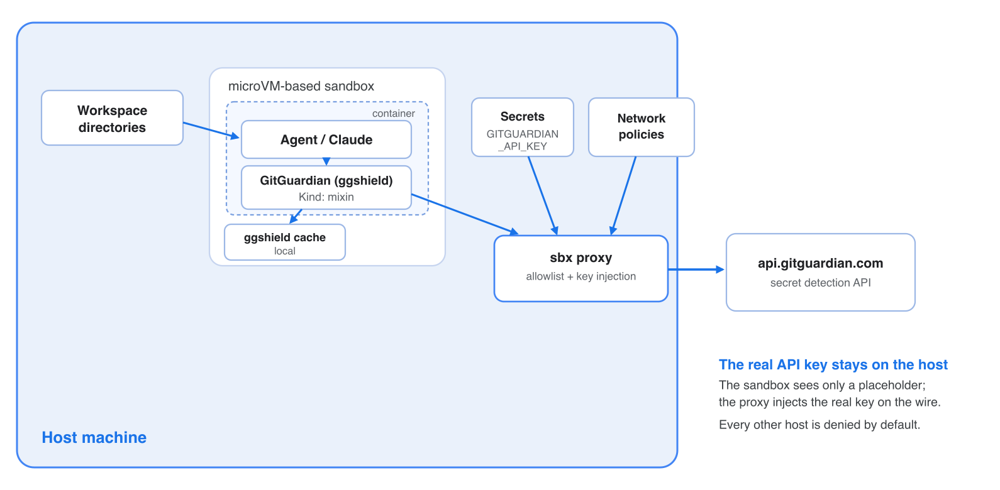

# sbx kit for gitguardian

A [Docker Sandboxes](https://docs.docker.com/ai/sandboxes/) **mixin** that adds
[GitGuardian](https://www.gitguardian.com/)'s
[`ggshield`](https://github.com/GitGuardian/ggshield) secret scanner to any
agent sandbox. It installs `ggshield` from a pinned, digest-verified GitHub
release at sandbox creation and wires up proxy-injected API-key auth for
`api.gitguardian.com` - so the agent can scan its workspace for hardcoded
secrets, but the real API key never enters the sandbox.

## Why this kit exists

AI coding agents generate and paste code fast, and hardcoded credentials slip
in - API keys, tokens, private keys in fixtures, `.env` files echoed into a
commit. `ggshield` catches them before `git commit`. Running it inside a
sandbox means the scanner (and the code it scans) executes in an isolated
microVM: your `~/.aws` / `~/.ssh` / `~/.docker/config.json` are not mounted, and
the GitGuardian API key is held on the host and injected by the proxy only on
outbound calls to `api.gitguardian.com` - the container sees a placeholder.

The kit doesn't just *offer* scanning - it **enforces** it. `ggshield` is
installed as a global Claude Code hook at sandbox creation, so the agent's own
actions are scanned for secrets automatically. That turns secret scanning from
advice the agent might skip into a deterministic gate sitting directly on the
agent's authorized output path (see
[Automatic enforcement](#automatic-enforcement-claude-code-hook)).

## Architecture



**The key isolation property:** `ggshield` inside the microVM only ever holds a
placeholder value for `GITGUARDIAN_API_KEY`. When it calls the GitGuardian API,
the sbx proxy rewrites the `Authorization: Token …` header with the real key
(sourced from the host) on the wire, and denies any egress to a host outside the
kit's four-entry allowlist. The real key never enters the sandbox - not in the
environment, shell history, or `ps` output.

## Usage

This is a mixin, so it layers onto a base agent with `--kit`. The kit wires
`ggshield` in as that agent's **AI hook**, so there is one artifact per coding
agent - pick the one that matches the agent you run:

| Agent     | OCI artifact                                | Hook file                     |
|-----------|---------------------------------------------|-------------------------------|
| `claude`  | `docker.io/ajeetraina777/gitguardian-kit`         | `~/.claude/settings.json`       |
| `codex`   | `docker.io/ajeetraina777/gitguardian-kit-codex`   | `~/.codex/hooks.json`           |
| `copilot` | `docker.io/ajeetraina777/gitguardian-kit-copilot` | `~/.copilot/hooks/hooks.json`   |
| `cursor`  | `docker.io/ajeetraina777/gitguardian-kit-cursor`  | `~/.cursor/hooks.json`          |

> `ggshield`'s AI-hook support covers `claude-code`, `codex`, `copilot`, and
> `cursor`. Other sbx agents (`gemini`, `droid`, `kiro`, `opencode`) have no
> ggshield AI hook - layer the kit onto them for the `ggshield` CLI + manual
> scanning, but there is no automatic enforcement hook.

```console
# From the published OCI artifact on Docker Hub (pin by digest - OCI refs
# require a digest, tags are rejected):
sbx run claude  --kit "oci://docker.io/ajeetraina777/gitguardian-kit@sha256:49e19c274226aef0e85f6b80aa95878ca7d2d1537ea4d48acf5c433557984184" .
sbx run codex   --kit "oci://docker.io/ajeetraina777/gitguardian-kit-codex@sha256:cdba24ef2fc85624ab5ef8a54d4ac7ac6464196aeba30751b9132ba36e90e4b7" .
sbx run copilot --kit "oci://docker.io/ajeetraina777/gitguardian-kit-copilot@sha256:d1403fcd9c5f3040f19e1ee26b2250baf6c6119c764b4013fd9033ed81a68ebc" .
sbx run cursor  --kit "oci://docker.io/ajeetraina777/gitguardian-kit-cursor@sha256:cb0acd4d34869bd9c8d6dbd683899ca0ea9b6918a801e77fe025ad28770d65fb" .

# From this git repo (root = claude; other agents live under kits/<agent>):
sbx run claude --kit "git+https://github.com/ajeetraina/sbx-kits-gitguardian.git" .

# From a local clone:
sbx run claude --kit ./ .
sbx run codex  --kit ./kits/codex .
```

The per-agent specs are generated from a single template
(`scripts/gen-kits.sh`) so they never drift; see [Publishing](PUBLISHING.md).

Then, inside the sandbox:

```console
agent@claude-project:~/project$ ggshield api-status
agent@claude-project:~/project$ ggshield secret scan path -r .   # working tree
agent@claude-project:~/project$ ggshield secret scan repo .      # full git history + working tree
```

`scan path -r .` scans the current files; `scan repo .` also walks the commit
history, so it catches secrets that were committed and later removed.

## Automatic enforcement (Claude Code hook)

The manual commands above are the *escape hatch*, not the primary control. At
sandbox creation the kit installs `ggshield` as a Claude Code **AI hook**, run
as the agent user so it lands in the agent's own `~/.claude/settings.json`:

```console
ggshield machine setup --agent claude-code --no-git-hooks --no-honeytokens
```

`ggshield machine setup` is the current entrypoint for AI-assistant hooks
(`claude-code`, `codex`, `copilot`, `cursor`, `vscode`); the older
`ggshield install --hook-type claude-code` still works but is deprecated. This
kit uses the `claude-code` hook because the thing running in the sandbox is a
Claude Code agent: it registers `PreToolUse` / `PostToolUse` /
`UserPromptSubmit` hooks that run `ggshield secret scan ai-hook` inside the
agent's own tool loop, scanning the content the agent produces rather than
waiting for a `git commit` that the agent could skip or bypass with
`--no-verify`. The kit scopes setup to the AI hook only (`--no-git-hooks`,
`--no-honeytokens`).

This is deliberately the strongest surface the kit has: the sandbox already
isolates the agent's filesystem and forces egress through the proxy, and putting
a deterministic scan on the agent's output path means a hardcoded secret is
caught by the tooling even when the agent forgets - or declines - to scan on its
own. A blocked action is a signal to remove and rotate the secret, **not** to
retry or bypass the hook; the bundled agent instructions tell the agent exactly
that.

You can confirm the setup inside a running sandbox with `ggshield machine
doctor`, which reports that the AI hook is installed and that the proxy-injected
token authenticates against GitGuardian.

## Credentials

The kit declares one credential, `gitguardian`, and marks it `required` - the
sandbox will not start without a binding.

1. Create an API key in the GitGuardian dashboard
   (**API → Personal access tokens**, or a Service Account) with the `scan`
   scope.

   > **Use a scan-only token.** This kit only needs `scan` (plus optionally
   > `scan:create-incidents`). A broad Personal Access Token carrying
   > `incidents:write`, `members:write`, `api_tokens:write`, `ip_allowlist:write`,
   > etc. undercuts the whole point of the kit - if that key is ever misused, the
   > blast radius is your entire workspace. Prefer a dedicated **Service Account**
   > token scoped to `scan` only. The kit isolates the key from the sandbox; a
   > least-privilege scope isolates the *damage* if the key leaks host-side.
2. Make it available to `sbx`, e.g.:

   ```console
   # Global (available to all sandboxes) - paste the PAT at the prompt:
   sbx secret set gitguardian

   # Scope the PAT to a single sandbox (e.g. one named "jfrog"), non-interactive:
   echo "gg_pat_t9XXXX" | sbx secret set gitguardian --sandbox jfrog
   ```

   The service name is always `gitguardian` (it must match the credential's
   `service` in `spec.yaml`); the value is your GitGuardian PAT (`gg_pat_...`),
   entered at the prompt or piped in via stdin.

   Alternatively, point a binding at an env var / file in
   `~/.config/sbx/credentials.yaml`:

   ```yaml
   bindings:
     gitguardian:
       discovery:
         - env: [GITGUARDIAN_API_KEY]
       allowedDomains:
         - api.gitguardian.com
   ```

Inside the container `GITGUARDIAN_API_KEY` is set to the placeholder
`proxy-managed` (the kit exports it via `environment.variables`, because
`gitguardian` is a custom service that sbx does not auto-materialize). The proxy
rewrites the `Authorization: Token <key>` header with the real value only on
requests to `api.gitguardian.com`, so the real token never enters the sandbox.

## How auth and egress work

GitGuardian's API authentication scheme is `Authorization: Token <api_key>`
(not `Bearer`), so the kit injects with `format: "Token %s"`.

The network allowlist is intentionally minimal:

| Host | Why |
| --- | --- |
| `github.com` | Release page entry point for the install tarball (302-redirects) |
| `objects.githubusercontent.com` | Redirect target for the release asset |
| `release-assets.githubusercontent.com` | Alternate redirect target for release assets |
| `api.gitguardian.com` | Runtime scan/verify API calls |

### EU workspace / self-hosted instances

`ggshield` defaults to `api.gitguardian.com`. For the EU workspace or a
self-hosted GitGuardian, set `GITGUARDIAN_INSTANCE` for the agent and add that
host to **both** `permissions.network.allow` and the credential's
`apiKey.inject[].domain` in `spec.yaml` (fork the kit) - the proxy only injects
into domains the kit declares.

### Multiple workspaces

Docker Sandboxes support multiple workspaces, not just the single . All you need to do is to pass extra directory paths as additional arguments to sbx run, and each appears inside the sandbox at its absolute host path. So you can give ggshield a much broader scope to scan.

```
# Multiple projects, some read-only
sbx run claude --kit "oci://.../gitguardian-kit@sha256:..." \
  ~/project-a ~/shared-libs:ro ~/docs:ro
```

Then inside the sandbox you can scan across all of them, e.g.:

```
ggshield secret scan path -r ~/project-a ~/shared-libs ~/docs
```

## Version pinning

The install command pins `GGSHIELD_VERSION=1.53.0` and a per-arch `SHA256`
(`x86_64-unknown-linux-gnu` and `aarch64-unknown-linux-gnu`). To bump: edit
`spec.yaml`, update the version string and both SHA256s (the `sha256sum` of
each release tarball from the
[releases page](https://github.com/GitGuardian/ggshield/releases)).

## License

The kit files are provided as-is. `ggshield` itself is distributed under its
own [license](https://github.com/GitGuardian/ggshield/blob/main/LICENSE).
