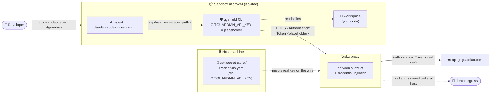

# sbx kit for gitguardian

A [Docker Sandboxes](https://docs.docker.com/ai/sandboxes/) **mixin** that adds
[GitGuardian](https://www.gitguardian.com/)'s
[`ggshield`](https://github.com/GitGuardian/ggshield) secret scanner to any
agent sandbox. It installs `ggshield` from a pinned, digest-verified GitHub
release at sandbox creation and wires up proxy-injected API-key auth for
`api.gitguardian.com` - so the agent can scan its workspace for hardcoded
secrets, but the real API key never enters the sandbox.

## Why this kit exists

AI coding agents generate and paste code fast, and hardcoded credentials slip
in - API keys, tokens, private keys in fixtures, `.env` files echoed into a
commit. `ggshield` catches them before `git commit`. Running it inside a
sandbox means the scanner (and the code it scans) executes in an isolated
microVM: your `~/.aws` / `~/.ssh` / `~/.docker/config.json` are not mounted, and
the GitGuardian API key is held on the host and injected by the proxy only on
outbound calls to `api.gitguardian.com` - the container sees a placeholder.

## Architecture



**The key isolation property:** `ggshield` inside the microVM only ever holds a
placeholder value for `GITGUARDIAN_API_KEY`. When it calls the GitGuardian API,
the sbx proxy rewrites the `Authorization: Token …` header with the real key
(sourced from the host) on the wire, and denies any egress to a host outside the
kit's four-entry allowlist. The real key never enters the sandbox - not in the
environment, shell history, or `ps` output.

## Usage

This is a mixin, so it layers onto a base agent with `--kit`. Pick any agent
(`claude` shown here) and add the kit:

```console
# From the published OCI artifact on Docker Hub (pin by digest - OCI refs
# require a digest, tags are rejected):
sbx run claude --kit "oci://docker.io/ajeetraina777/gitguardian-kit@sha256:eb085e4af6a50b8b84f179dd9e1b53a1d23b200c65a44adacb77fcf916ef67cc" .

# From this git repo:
sbx run claude --kit "git+https://github.com/ajeetraina/sbx-kits-gitguardian.git" .

# From a local clone:
sbx run claude --kit ./ .
```

Then, inside the sandbox:

```console
agent@claude-project:~/project$ ggshield api-status
agent@claude-project:~/project$ ggshield secret scan path -r .
```

## Credentials

The kit declares one credential, `gitguardian`, and marks it `required` - the
sandbox will not start without a binding.

1. Create an API key in the GitGuardian dashboard
   (**API → Personal access tokens**, or a Service Account) with the `scan`
   scope.
2. Make it available to `sbx`, e.g.:

   ```console
   # Global (available to all sandboxes) - paste the PAT at the prompt:
   sbx secret set gitguardian

   # Scope the PAT to a single sandbox (e.g. one named "jfrog"), non-interactive:
   echo "gg_pat_t9XXXX" | sbx secret set gitguardian --sandbox jfrog
   ```

   The service name is always `gitguardian` (it must match the credential's
   `service` in `spec.yaml`); the value is your GitGuardian PAT (`gg_pat_...`),
   entered at the prompt or piped in via stdin.

   Alternatively, point a binding at an env var / file in
   `~/.config/sbx/credentials.yaml`:

   ```yaml
   bindings:
     gitguardian:
       discovery:
         - env: [GITGUARDIAN_API_KEY]
       allowedDomains:
         - api.gitguardian.com
   ```

Inside the container `GITGUARDIAN_API_KEY` is set to the placeholder
`proxy-managed` (the kit exports it via `environment.variables`, because
`gitguardian` is a custom service that sbx does not auto-materialize). The proxy
rewrites the `Authorization: Token <key>` header with the real value only on
requests to `api.gitguardian.com`, so the real token never enters the sandbox.

## How auth and egress work

GitGuardian's API authentication scheme is `Authorization: Token <api_key>`
(not `Bearer`), so the kit injects with `format: "Token %s"`.

The network allowlist is intentionally minimal:

| Host | Why |
| --- | --- |
| `github.com` | Release page entry point for the install tarball (302-redirects) |
| `objects.githubusercontent.com` | Redirect target for the release asset |
| `release-assets.githubusercontent.com` | Alternate redirect target for release assets |
| `api.gitguardian.com` | Runtime scan/verify API calls |

### EU workspace / self-hosted instances

`ggshield` defaults to `api.gitguardian.com`. For the EU workspace or a
self-hosted GitGuardian, set `GITGUARDIAN_INSTANCE` for the agent and add that
host to **both** `permissions.network.allow` and the credential's
`apiKey.inject[].domain` in `spec.yaml` (fork the kit) - the proxy only injects
into domains the kit declares.

## Version pinning

The install command pins `GGSHIELD_VERSION=1.53.0` and a per-arch `SHA256`
(`x86_64-unknown-linux-gnu` and `aarch64-unknown-linux-gnu`). To bump: edit
`spec.yaml`, update the version string and both SHA256s (the `sha256sum` of
each release tarball from the
[releases page](https://github.com/GitGuardian/ggshield/releases)).

## License

The kit files are provided as-is. `ggshield` itself is distributed under its
own [license](https://github.com/GitGuardian/ggshield/blob/main/LICENSE).
